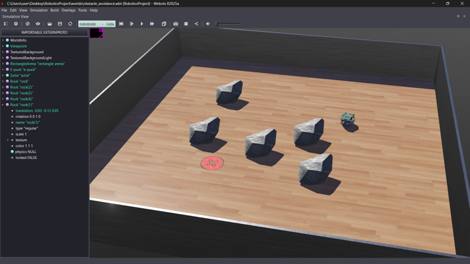
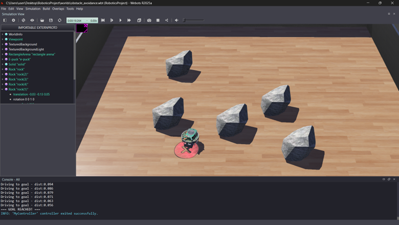

# Obstacle Avoidance with Goal Navigation
## RoboCup Robotics Project

### Project Description
An E-puck robot navigates autonomously from a start position (Point A) to a goal position (Point B) inside a RoboCup-style field, detecting and avoiding rock obstacles using distance sensors, GPS and compass.

### Robot Used
E-puck wheeled robot (Webots R2025a)

### How to Run
1. Open Webots
2. Open `worlds/obstacle_avoidance.wbt`
3. Press the Play button
4. The robot will automatically navigate to the goal

### How It Works
1. Robot uses **GPS** to know its exact position
2. Robot uses **Compass** to calculate the angle toward the goal
3. Robot rotates to face the goal direction
4. Robot drives straight toward goal
5. If **distance sensors** detect an obstacle ahead, robot stops, turns 90 degrees, moves sideways to clear it, then re-orients toward goal
6. Robot stops when it reaches the goal marker

### Simulation Demo

#### Starting Position

#### Goal Reached

#### Video Demo
https://github.com/Hasan-Badaood/Obstacle-Avoidance-of-Robots-and-Goalposts-in-a-RoboCup-Field/raw/main/screenshots/obstacle_avoidance_vid.mp4

### Project Structure
- `worlds/` - Webots simulation world file
- `controllers/` - Python robot controller code
- `screenshots/` - Screenshots and video of simulation
- `report/` - Final PDF report
